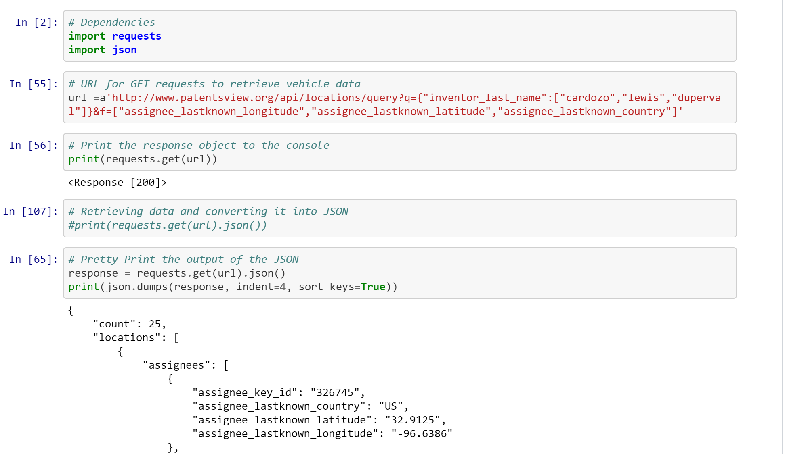
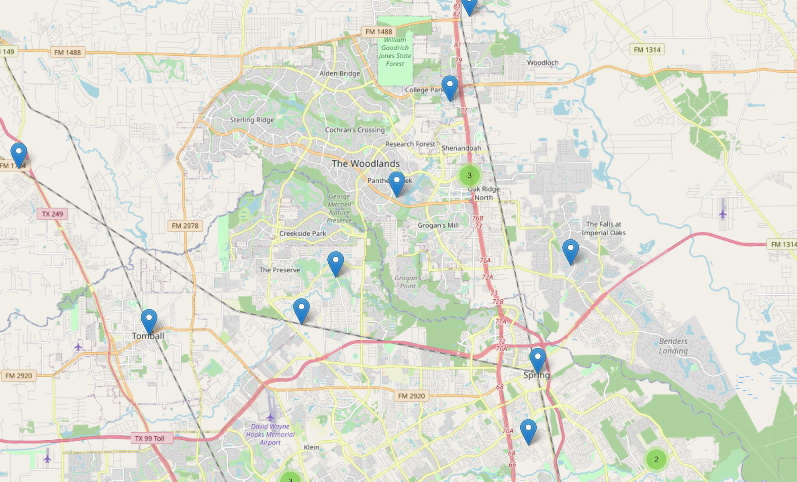
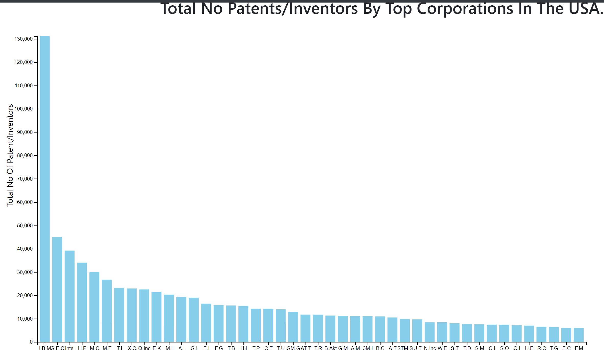
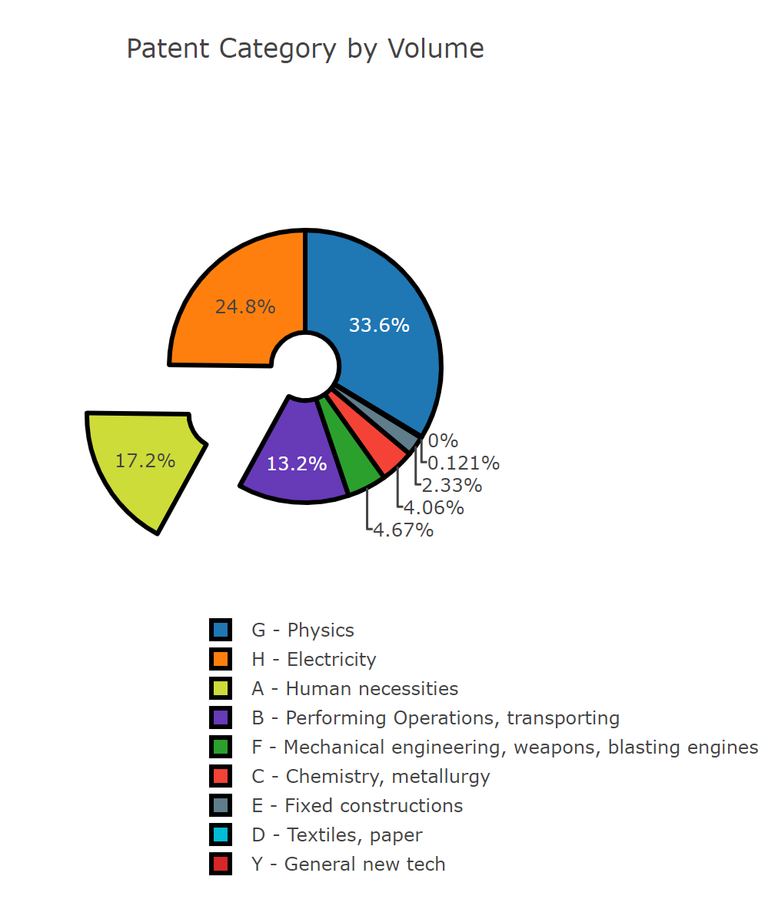

United States patents analyzed in interactive visuals. Data was downloaded via API from the United States patent API. 

A good explaination of an API can be found here: https://www.freecodecamp.org/news/what-is-an-api-in-english-please-b880a3214a82/
And example of requesting information from the API using your very own Jupyter Notebook is below:

The results of the API can be delivered in a dictionary with lists.

Using leaflet we can immediately map the location of where a patent was filed (year 2018)

The map shows the patents filed around my home.

Using Plotly, we can display the patent API information in bar graph by corporation:

And also by volume in category:

Adding these graphs to a dashboard via website, it is easy to make them interactive so that clicking on certain fields will expose further lists of information.
